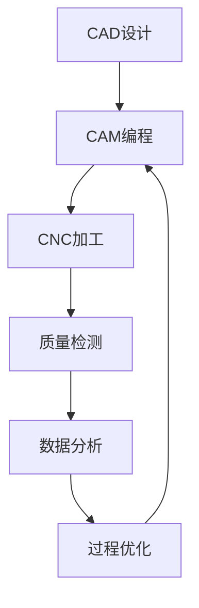

# CNC制造完全指南：AI赋能的透明制造体系

现代CNC制造正在经历深刻变革，从传统的经验驱动转向数据驱动的智能制造。作为**AI赋能的专家服务的透明制造合作伙伴**，我们深耕制造领域十余年，构建了完整的透明制造知识体系。本指南基于我们的专业实践，为您提供从设计优化到批量交付的全流程制造洞察，实现质量、效率与成本的最优平衡。

[图片占位符：现代CNC制造车间全景，展示5轴加工中心、质量检测设备和数字化管理系统]

## 第一章：制造设计基础

### 面向制造的设计原则

**透明制造设计理念**：
- **简化优于复杂**：基于成本透明分析，减少不必要的特征和操作
- **标准化优于定制**：使用行业标准尺寸和公差，降低制造复杂度
- **价值驱动设计**：每项设计决策都有明确的成本影响分析
- **可制造性验证**：AI辅助DFM分析，确保每个特征的最优制造方案
- **柔性制造兼容**：设计考虑多种制造路径，适应不同批量需求

[图片占位符：DFM设计对比图，展示优化前后的零件设计差异]

### 关键设计参数

**尺寸与公差控制**：
```
标准公差等级：
- 一般要求：±0.1mm (±0.004")
- 装配要求：±0.05mm (±0.002")
- 项目定制精度标准：基于功能需求和成本效益分析确定最优精度等级
- 表面粗糙度：Ra 0.8-3.2μm (标准范围)
```

**特征设计指导**：
- **圆角半径**：最小0.5mm，推荐≥1mm
- **壁厚**：铝合金最小1.5mm，钢材最小2mm
- **孔径**：使用标准钻头尺寸
- **螺纹**：优先选择标准螺纹规格

[图片占位符：设计规范图表，展示各种特征的推荐尺寸和公差]

## 第二章：材料科学与选择

### 材料性能矩阵

现代制造项目的材料选择是性能、成本和可制造性的综合权衡。基于我们**专业领域深耕优势**，我们构建了完整的材料-应用数据库，为每种应用场景提供最优材料方案：

[图片占位符：材料性能对比雷达图，展示强度、重量、成本、可加工性等维度]

**铝合金系列**：
```
6061-T6 铝合金：
- 密度：2.70 g/cm³
- 抗拉强度：310 MPa
- 精度能力：行业标准精度范围内
- 应用：航空、电子、通用制造
- 成本系数：1.0x (基准)

7075-T6 铝合金：
- 密度：2.81 g/cm³  
- 抗拉强度：572 MPa
- 精度能力：项目定制精度标准
- 应用：高强度结构件
- 成本系数：1.5x
```

**钢材选择指南**：
```
4140 合金钢：
- 热处理性能优异
- 高强度应用首选
- 加工性能：良好
- 成本效益：中等

316L 不锈钢：
- 耐腐蚀性卓越
- 食品级应用
- 加工难度：中等
- 成本系数：2.5x
```

[图片占位符：各类材料样品展示，包括铝合金、钢材、工程塑料等]

### 材料-应用匹配策略

**行业应用矩阵**：

| 行业 | 首选材料 | 关键要求 | 典型应用 |
|------|----------|----------|----------|
| 航空航天 | 7075-T6, Ti-6Al-4V | 强度重量比 | 结构件、紧固件 |
| 医疗器械 | 316L, Ti-6Al-4V | 生物相容性 | 植入物、手术器械 |
| 电子产品 | 6061-T6 | 散热性能 | 散热器、外壳 |
| 汽车工业 | 6061-T6, 4140钢 | 成本效益 | 支架、连接件 |

[图片占位符：不同行业应用的实际产品案例图]

---

## 第三章：先进制造工艺

理解了材料特性后，接下来我们深入探讨如何通过先进的制造工艺将材料转化为精密产品。现代CNC制造的核心在于工艺技术的持续创新和智能化应用。

### 多轴加工技术：柔性制造的核心

**5轴加工优势**：
- **复杂几何**：一次装夹完成复杂曲面，体现柔性制造响应能力
- **精度保证**：减少装夹次数提高精度，确保一致性品质
- **效率提升**：缩短总加工时间40-60%，快速响应客户需求
- **表面质量**：连续切削获得更好光洁度，满足高端应用要求
- **批量适应性**：从单件到中小批量的灵活切换能力

[图片占位符：5轴加工中心加工复杂零件的动态图]

**加工策略选择**：
```cpp
// 加工策略决策算法示例
ProcessStrategy selectStrategy(Part part) {
    if (part.complexity > HIGH_THRESHOLD) {
        return FIVE_AXIS_CONTINUOUS;
    } else if (part.precision > TIGHT_TOLERANCE) {
        return THREE_AXIS_HIGH_PRECISION;
    } else {
        return CONVENTIONAL_MACHINING;
    }
}
```

### 自适应制造技术：智能制造的深度实践

**实时过程优化**：
基于我们十余年的制造数据积累，我们开发了具有自主知识产权的自适应制造系统：

- **智能切削力监控**：实时分析切削力变化，自动调整进给速度和主轴转速，防止刀具破损和工件变形
- **预测性刀具管理**：基于机器学习模型预测刀具寿命，实现99.5%的刀具利用率，大幅降低制造成本
- **热变形智能补偿**：集成红外温度传感和机器学习算法，实时修正热变形影响，确保长时间加工的精度稳定性
- **闭环质量反馈**：在线测量数据自动反馈到加工程序，实现质量的前瞻性控制而非被动检测

[图片占位符：智能制造系统界面，展示实时监控数据和自动调整过程]

---

## 第四章：透明质量控制体系

先进的制造工艺需要配套的质量保证体系。我们构建的透明质量控制体系不仅确保产品品质，更让客户全程了解质量形成过程。

### 全流程质量管理：每个环节可视可控

基于我们的**Transparent Breakdown Pricing体系**，质量控制不仅确保产品卓越，更实现制造过程的完全透明：

**质量控制阶段**：
1. **设计审查**：AI辅助DFM分析，透明展示质量风险点和优化建议
2. **首件检验**：关键尺寸和表面质量验证，实时数据共享
3. **过程监控**：实时质量数据采集分析，客户可视化跟踪
4. **最终检验**：全尺寸CMM测量和功能测试，完整质量报告交付
5. **质量追溯**：全程数字化记录，每个制造节点透明可查

[图片占位符：质量控制流程图，展示从设计到交付的质量检查点]

### 测量技术与设备

**精密测量设备与专业应用**：
基于我们的专业领域深耕优势，配置了完整的精密测量体系：

```
海克斯康三坐标测量机(CMM)：
- 测量精度：行业标准精度等级
- 测量范围：2000mm × 1500mm × 800mm
- 温度控制：20±0.5°C恒温环境
- 专业应用：复杂几何形状的尺寸和形位公差全检

雷尼绍激光干涉仪：
- 精度：亚微米级测量能力
- 应用：机床几何精度校准、热变形补偿标定
- 频率：月度定期校准，确保设备精度稳定性

泰勒霍普森表面轮廓仪：
- 分辨率：纳米级表面特征检测
- 应用：表面粗糙度、波纹度、轮廓度测量
- 标准：符合ISO 4287/4288国际标准
```

**测量数据价值挖掘**：
我们不仅进行测量，更通过AI分析测量数据，为工艺优化提供洞察：
- 统计分析识别系统性偏差模式
- 预测模型预警潜在质量风险
- 工艺参数与质量结果的关联分析

[图片占位符：现代化质量检测实验室，展示CMM、轮廓仪等精密测量设备]

### 统计过程控制

**SPC实施策略**：
```python
# 过程能力分析示例
def calculate_cpk(measurements, upper_spec, lower_spec):
    mean = np.mean(measurements)
    std = np.std(measurements, ddof=1)
    
    cpu = (upper_spec - mean) / (3 * std)
    cpl = (mean - lower_spec) / (3 * std)
    
    cpk = min(cpu, cpl)
    return cpk

# 目标：关键尺寸 Cpk > 1.33
```

[图片占位符：SPC控制图表，展示过程能力分析和趋势监控]

---

## 第五章：透明成本优化策略

质量和成本往往存在权衡关系。通过我们的透明成本分析方法，客户可以在保证质量的前提下，实现成本的最优配置。

### 全生命周期成本分析：每一分钱都有明确去向

基于我们的**Transparent Breakdown Pricing体系**，我们不仅提供竞争性价格，更让每项成本透明可见，助力客户做出最优决策：

**透明成本构成分解**：
```
制造成本结构：
├── 材料成本 (35-45%)
│   ├── 原材料费用
│   ├── 材料浪费成本
│   └── 库存成本
├── 加工成本 (25-35%)
│   ├── 机器工时费用
│   ├── 刀具消耗成本
│   └── 能源消耗费用
├── 人工成本 (15-25%)
├── 质量成本 (5-15%)
└── 管理成本 (5-10%)
```

[图片占位符：成本构成饼状图和成本优化对比分析]

### 价值工程方法

**透明成本降低策略**：
基于我们的Transparent Breakdown Pricing体系，每项优化都有量化的成本影响分析：

1. **智能设计优化**：
   - **特征简化分析**：AI识别高成本特征，提供替代设计方案（典型节约15-25%）
   - **标准化价值工程**：优先使用标准刀具和装夹方案，降低setup成本
   - **材料利用率优化**：嵌套算法优化排料，材料利用率提升至85%以上
   - **一体化设计**：减少装配件数量，避免二次加工成本

2. **智能工艺改进**：
   - **批量经济性分析**：精确计算不同批量的单件成本拐点
   - **自动化ROI评估**：量化自动化投资的成本效益
   - **刀具寿命建模**：基于切削参数预测刀具寿命，优化更换时机
   - **零缺陷制造**：通过过程控制实现99.5%首次通过率

3. **供应链透明化**：
   - **材料价格实时追踪**：建立材料价格数据库，把握采购时机
   - **交期成本权衡**：透明展示加急费用与标准交期的成本差异
   - **库存成本可视化**：精确计算持有成本，优化库存策略

[图片占位符：价值工程分析图表，展示成本优化前后对比]

---

## 第六章：AI赋能的数字化制造集成

现代制造业正在经历数字化转型。我们通过AI技术的深度集成，不仅提升了制造效率，更为客户创造了前所未有的制造体验。

### 工业4.0技术应用：智能制造的深度实践

作为**AI赋能的专家服务**提供商，我们将人工智能技术深度融入制造全流程，实现真正的智能制造：

**AI驱动的制造架构**：


[图片占位符：数字化工厂概念图，展示各系统的连接和数据流]

**AI智能制造功能**：
- **数字孪生**：虚拟仿真验证加工过程，降低试制成本
- **预测性维护**：基于数据的设备维护，确保交期稳定性
- **自适应控制**：AI实时参数优化，提升效率和质量
- **智能质量追溯**：完整的生产记录追踪，支持透明制造
- **柔性排产优化**：AI动态调度，快速响应紧急需求

### AI辅助制造优化

**机器学习应用**：
```python
# AI参数优化示例
class MachiningOptimizer:
    def __init__(self):
        self.model = load_trained_model()
    
    def optimize_parameters(self, material, geometry, requirements):
        features = self.extract_features(material, geometry, requirements)
        optimal_params = self.model.predict(features)
        return {
            'cutting_speed': optimal_params[0],
            'feed_rate': optimal_params[1],
            'depth_of_cut': optimal_params[2]
        }
```

[图片占位符：AI辅助制造系统界面，展示参数优化和预测分析]

## 第七章：可持续制造实践

### 绿色制造策略

**环境影响最小化**：
- **能源效率**：优化加工参数降低能耗
- **材料回收**：金属废料100%回收利用
- **冷却液管理**：环保切削液选择和循环使用
- **废物减少**：提高材料利用率和首次通过率

[图片占位符：绿色制造实践图，展示废料回收和环保措施]

### 循环经济模式

**可持续价值链**：
```
原材料 → 设计优化 → 高效制造 → 产品使用 → 材料回收
    ↑                                           ↓
    ←-------- 循环利用 ←-------- 再制造 ←--------
```

[图片占位符：循环经济流程图，展示材料的循环利用路径]

## 第八章：行业应用案例

### 航空制造案例：涡轮叶片

**项目挑战**：
- 材料：Ti-6Al-4V钛合金（高难度加工材料）
- 复杂曲面精度要求：项目定制精度标准
- 表面粗糙度：Ra 0.4μm（航空级表面要求）
- 单件价值：$15,000+（零缺陷交付要求）

**解决方案**：
```
制造流程优化：
1. 5轴连续加工减少装夹次数
2. 自适应控制防止颤振
3. 实时温度补偿确保精度
4. 多点测量验证关键尺寸

结果：
- 加工时间：28小时 → 16小时 (-43%)
- 首次通过率：75% → 95%
- 材料利用率：65% → 82%
```

[图片占位符：涡轮叶片加工过程和成品质量检测]

### 医疗器械案例：髋关节植入物

**制造要求**：
- 生物相容性材料选择
- 极高的表面质量要求
- 严格的清洁度标准
- 完整的质量追溯

**创新方案**：
- 数字化质量系统全程记录
- 激光表面处理提升生物相容性
- 无损检测确保内部质量
- 包装前无菌环境处理

[图片占位符：医疗器械制造的洁净车间和质量检测过程]

## 第九章：未来制造趋势

### 技术发展方向

**新兴技术集成**：
- **增材-减材混合制造**：结合3D打印和CNC加工
- **纳米级精度加工**：超精密制造技术
- **智能材料应用**：形状记忆合金等新材料
- **全自动化产线**：从设计到交付的无人化制造

[图片占位符：未来制造技术概念图，展示先进制造设备和自动化系统]

### 制造服务模式创新

**服务化制造**：
- **按需制造**：小批量快速响应
- **云端制造**：分布式制造网络
- **透明定价**：实时成本可视化
- **全程可视**：制造过程透明化

## 制造成本计算器

为了帮助您更好地规划制造项目，我们提供以下成本估算工具：

[交互式组件占位符：成本计算器]
```javascript
// 成本计算逻辑示例
function calculateCost(material, volume, complexity, quantity) {
    const baseCost = getMaterialCost(material) * volume;
    const complexityFactor = getComplexityFactor(complexity);
    const quantityDiscount = getQuantityDiscount(quantity);
    
    return baseCost * complexityFactor * quantityDiscount;
}
```

## 制造时间估算工具

[交互式组件占位符：交期计算器]
```javascript
// 交期计算逻辑
function estimateDelivery(partComplexity, quantity, materialAvailability) {
    const programmingTime = calculateProgrammingTime(partComplexity);
    const machiningTime = calculateMachiningTime(quantity);
    const qcTime = calculateQCTime(quantity);
    const materialLeadTime = getMaterialLeadTime(materialAvailability);
    
    return Math.max(programmingTime + machiningTime + qcTime, materialLeadTime);
}
```

## 结论：透明制造的卓越实践

现代CNC制造的成功需要从传统制造思维转向透明、智能、协同的新模式。作为**AI赋能的专家服务的透明制造合作伙伴**，我们通过深度整合三大核心优势，为客户创造超越期望的制造价值。

**透明制造成功要素**：
1. **AI技术赋能**：智能制造技术深度应用，提升效率和质量
2. **透明定价体系**：每个成本环节清晰可见，优化决策支持
3. **柔性制造响应**：快速适应不同批量和复杂度需求
4. **专业深耕优势**：十余年制造经验积累的专业洞察
5. **全程透明可视**：从报价到交付的完整过程透明化
6. **客户协同创新**：与客户共同优化产品和制造方案

[图片占位符：成功制造项目的综合展示，包括产品、团队和设备]

**透明制造的核心价值**：
- ✅ **决策透明化**：每个制造决策都有清晰的成本和质量影响分析
- ✅ **过程可视化**：从设计到交付的全流程实时可追踪
- ✅ **结果可预期**：基于数据驱动的质量和交期保障
- ✅ **成本可优化**：持续的价值工程实现成本效益最大化

未来的制造将更加智能化、透明化和可持续化。作为**AI赋能的专家服务的透明制造合作伙伴**，我们致力于通过技术创新和服务升级，为每一位客户创造超越期望的制造价值。

## 开始您的透明制造项目

准备将这些先进制造理念应用到您的项目中？作为**AI赋能的专家服务的透明制造合作伙伴**，Geppetto结合深厚的制造专业知识与前沿AI技术，为您提供从设计优化到批量交付的全透明制造服务。

**我们的三大核心优势**：
- 🔍 **Transparent Breakdown Pricing体系**：每个成本环节透明可见，助力最优决策
- ⚡ **柔性制造响应能力**：从单件试制到中小批量的灵活切换
- 🎯 **专业领域深耕优势**：十余年制造经验，深度理解行业需求
- 🧠 **AI技术深度融入**：智能编程、参数优化、质量预测

**体验透明制造服务** - 上传您的CAD文件，8小时内获得专家级技术分析和透明定价方案。让每一个制造细节都清晰可见，让每一分投入都物有所值。

[图片占位符：团队合作和客户服务场景图]